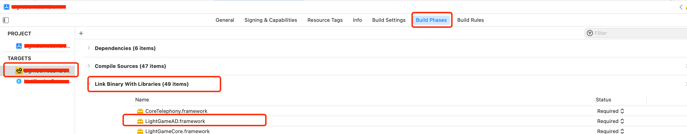
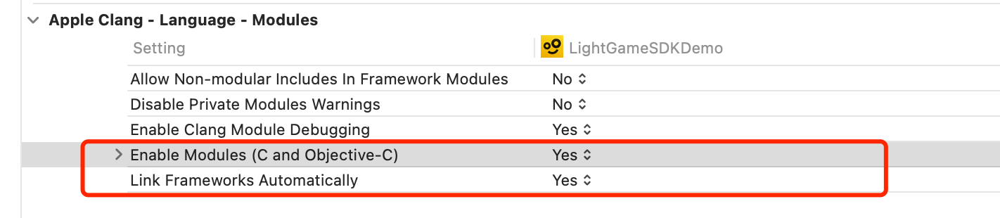

# iOS 上的自动链接（ Auto Linking ）

## 背景知识

当我们在 Xcode 的 Build Phases -> Link Binary With Library 中添加一个 framework 的依赖。例如下图：



Xcode 实际上做的是：

1. 在链接器链接的时候，添加对应的链接器标志，即`-framework LightGameAD` 。对应 Build Setting 中的 Other Linker Flags 设置。
2. 添加对应 framework 的搜索路径，eg: `-F/Users/xxx/.../LightGameAD` 。对应 Build Setting 中的 Framework Search Paths 设置。

换句话说，当我们需要 link 一个 framework 时，完全也可以通过修改 Build Setting 中的设置来链接，不需要设置 Build Phases -> Link Binary With Library 。事实上，我们常用的 Cocoapod ，就是通过设置 build setting 来设置 framework 的链接的。

> .a 静态库也可以通过同样的方式设置，分别对应 Other Linker Flags 的 `-lxxx` 以及 Library Search Paths（`-L/Users/xxx/.../Library目录`）。这里有一点和 Framework 不同。
> 如果静态库有 lib 前缀，eg: libxxx.a，在引入时，对应 Other Linker Flags 的 -lxxx。这也是为什么通过 Cocoapod 导入的 .a静态库，都需要 lib 前缀，否则会报找不到符号。
> 如果没有lib前缀，那相当于直接将 Other Linker Flags  中添加 /xxx/xxx/xxx.a，也不需要添加 Library Search Paths，因为此时路径已经明确，不需要查找 Library。


同理，当我们需要添加一个系统库的依赖时，因为系统默认会搜索系统库所在目录，所以可以只在 Other Linker Flags 中添加上对应的 flag 即可。eg: `-framework UIKit` 即可，效果等同于在 Build Phases -> Link Binary With Library 添加 UIKit.framework 。

 

## 什么是自动链接？

当目标文件（.o文件）在最终构建阶段链接时，链接器要知道哪些库需要被链接。例如，如果将 `#import <AdServices/AdServices>` 添加到实现文件（.m文件），我们需要将`-framework AdServices` 标志添加到链接器。

自动链接旨在帮助我们去掉最后一步。换句话说，它旨在从代码中的导入语句派生库链接器的 flag 标志。开发人员不需要添加任何 framework / Library 的链接器标志，可以通过导入语句直接使用任何 framework / Library。

> 这里的导入语句，包括在 Objective-C 中使用 #import 和 @import，也包括 Swift 中的 import 。


## 自动链接的原理

自动链接通过在目标文件中插入链接器标志来工作。当链接器创建最终的可执行文件时，这些链接器标志就好像作为参数传递一样。

链接器标志存储在目标文件中的 `LC_LINKER_OPTION` Load Command 命令。comand 的结构体如下：

```c
struct linker_option_command {
    uint32_t  cmd;	/* LC_LINKER_OPTION only used in MH_OBJECT filetypes */
    uint32_t  cmdsize;
    uint32_t  count;	/* number of strings */
    /* concatenation of zero terminated UTF8 strings.
       Zero filled at end to align */
};
```


可以使用 `otool -l xxx.o`  命令来打印它们：

```tex
Load command 5
     cmd LC_LINKER_OPTION
 cmdsize 32
   count 2
  string #1 -framework
  string #2 AppKit
Load command 6
     cmd LC_LINKER_OPTION
 cmdsize 40
   count 2
  string #1 -framework
  string #2 QuartzCore
```

当然也可以通过一些可视化工具来查看，例如：MachOView、MachO-Explorer 等工具。


## Framework vs Dynamic Library

值得注意的是，自动链接可以与任何 Clang 模块一起使用，而不仅仅是 Framework 。例如，/Applications/Xcode.app/Contents/Developer/Platforms/iPhoneOS.platform/Developer/SDKs/iPhoneOS.sdk/usr/include/module.moduleMap 中定义了如下所示的 `zlib` 模块：

```tex
module zlib [system] [extern_c] {
 header "zlib.h"
 export *
 link "z"
}
```

上述意味着如果我们使用 `#import <zlib.h>`，打开 Enable Modules 开关，则链接器自动插入`-lz`。我们可以使用 `otool -l` 验证此问题：

```
Load command 4
     cmd LC_LINKER_OPTION
 cmdsize 16
   count 1
  string #1 -lz
```


## 控制自动链接开关

仅当 Clang Enable Modules 开关打开时，自动链接才生效。如果你是通过命令行调用 clang，则需要添加 `-fmodules` 参数。在 Xcode Build Setting 中对应的 key 为 `CLANG_ENABLE_MODULES` （ Enable Modules (C and Objective-C) ）

即使启用了模块，也可以单独禁用自动链接。对应的 clang 命令行参数为 `-fno-autolink` 。在 Xcode Build Setting 中对应的 key 为 `CLANG_MODULES_AUTOLINK` （ Link Frameworks Automatically ）




## 注意事项

1. 是否启用了自动链接，只和这个源文件被编译的时候的设置有关，和使用的地方是否开启自动链接无关。举个栗子：
    1. 当我们生成一个 target 为 Framework 的工程，这里叫做 ABC.framework 吧。我们的 ABC.framework 依赖了两个系统库 JavaScriptCore.framework 、libz.tbd 。
    2. 如果 ABC.framework 工程开启了自动链接，生成了最终产物 ABC.framework。此时当我们的 ABC.framework 被使用的时候，也就是被另一个 target 引入的时候，可以直接使用，不需要再添加 JavaScriptCore.framework 、libz.tbd 这两个系统库的依赖。即使 target 的自动链接或模块开关关闭，也可以直接使用。
    3. 如果 ABC.framework 工程关闭了自动链接，此时被使用时，就必须添加相应库的依赖。

注意上面的例子，只和 ABC.framework 的设置有关，和使用方的 target 设置无关。这是因为，我们的源文件在被编译的时候，已经根据对应的设置，决定了是否包含链接需要的信息。

2. 自动链接不仅仅可以用来链接系统库，也同样可以用来链接我们自己生成的 Framework 库。前面说过，自动链接相当于自动帮我们添加了 `-framework xxx` ，所以我们只需要在 `Framework Search Path` 中添加对应 Framework 的路径即可。

3. 自动链接的 Framework 如果找不到，本身并不会编译报错或启动 crash，只会报警告。当然，如果你确实使用了被链接的 Framework 中的符号，还是会报符号找不到的。举个栗子：
    1. iOS14 新出的 AppTrackingTransparency.framework。如果我们的应用需要支持iOS14一下，我们的代码通常会写成如下：
    ``` objc
    // iOS14以上，使用 AppTrackingTransparency 框架
    if (@available(iOS 14.0, *)) {
        if ([ATTrackingManager trackingAuthorizationStatus] == ATTrackingManagerAuthorizationStatusNotDetermined) {
            [ATTrackingManager requestTrackingAuthorizationWithCompletionHandler:^(ATTrackingManagerAuthorizationStatus status) {
                //处理idfa状态
            }
        } else {
            //处理idfa状态
        }
    } else {
        // iOS14以下，使用 AdSupport 框架
        //处理idfa状态
        // [[ASIdentifierManager sharedManager] isAdvertisingTrackingEnabled]
    }
    ```
    2. 因为我们代码中已经根据系统版本做了判断，如果使用自动链接，当在14以下版本的时候，自动链接链接不到 AppTrackingTransparency 框架，但是此时因为代码也没有对 AppTrackingTransparency 框架的符号引用，所以不会有任何问题。但是如果是手动依赖链接，则这里一定要设置为 optional，也就是弱链接。如果是 required，会启动崩溃。